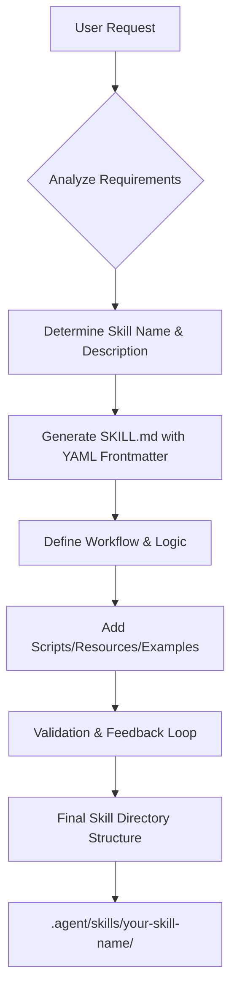

# Skill Creator

An expert AI assistant specialized in generating high-quality, predictable, and efficient "Skills" for the Antigravity agent environment. This project provides the system instructions and framework to build structured skills that follow best practices for progressive disclosure, conciseness, and predictable workflows.

## 🚀 Workflow Diagram

## 📂 Project Structure

- `antigravity-skill-creator.md`: The core system instructions and guidelines for creating skills.
- `.agent/skills/`: A directory containing pre-built or generated skills.
- `.gitignore`: Standard Git ignore rules for the project.

## 🛠️ Core Principles

1.  **Strict Hierarchy**: All skills follow a standard structure with `SKILL.md` at the root.
2.  **YAML Standards**: Precise naming conventions and third-person descriptions.
3.  **Progressive Disclosure**: Keeping instructions focused and linking to deep-dive resources when necessary.
4.  **The "Claude Way"**: Conciseness, smart heuristics, and standard pathing for maximum compatibility.

## 📖 How to Use

1.  **Load Instructions**: Point your agent to the `antigravity-skill-creator.md` file.
2.  **Trigger Creation**: Request a new skill using the trigger phrase:
    > "Based on my skill creator instructions, build me a skill for [Specific Task]."
3.  **Deploy**: Copy the generated output into your `.agent/skills/` directory.

---
*Created by Naresh Masetti (https://github.com/masettinaresh)*
